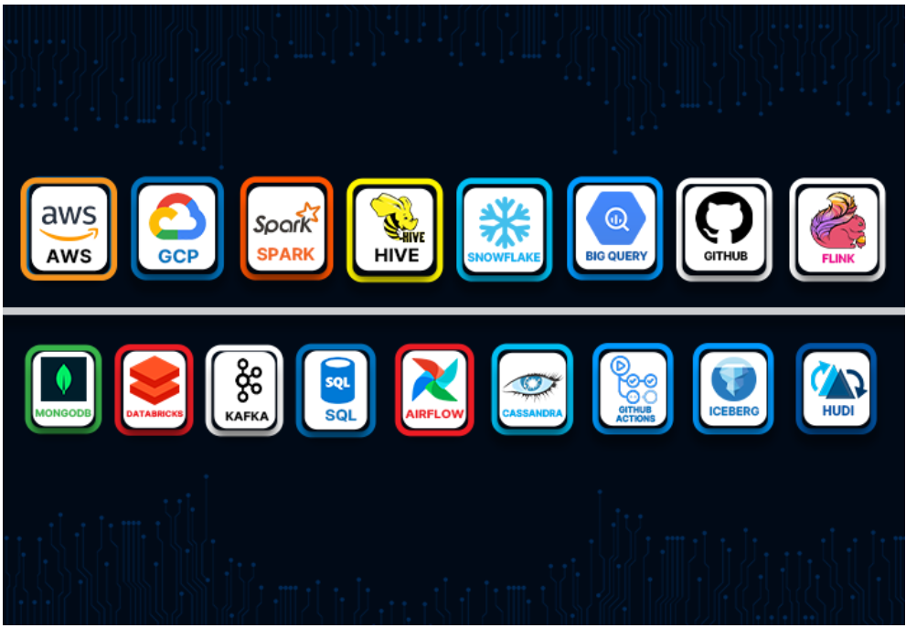

## 📊 Big Data Study – Data Engineering Bootcamp

This repository documents my learning journey and hands-on practice from the **“Data Engineering with AWS – Basic to Advanced” bootcamp**.
It covers core to advanced concepts of modern data engineering, with a strong focus on **scalable data pipelines, big data processing, cloud platforms, and real-world industrial use cases**.

The goal of this repository is to **build production-ready data engineering skills** by combining theory, practical implementations, and end-to-end projects using industry-standard tools and frameworks.

---

## 🧠 What This Bootcamp Covers

### 🔹 Core Foundations

* **SQL** for data analysis and transformation
* **Big Data Fundamentals**
* **Hadoop Ecosystem & Hive**

### 🔹 Streaming & Messaging

* **Apache Kafka (Confluent Platform)**
* **Apache Flink** for real-time stream processing

### 🔹 NoSQL Databases

* **MongoDB**
* **Apache Cassandra**

### 🔹 Big Data Processing

* **Apache Spark (PySpark)**
* **Databricks**

### 🔹 Workflow Orchestration

* **Apache Airflow** for scheduling and monitoring pipelines

### 🔹 Data Warehousing & Analytics

* **Data Warehousing Concepts**
* **Snowflake**
* **Google BigQuery**

### 🔹 Cloud & Modern Data Lakehouse

* **AWS Cloud Services**
* **Apache Iceberg & Apache Hudi**

### 🔹 Real-World Experience

* **16 Industrial-Level Projects**
* End-to-end data pipelines
* Batch & streaming use cases
* Data quality, optimization, and scalability

---

## 🎯 Key Takeaways

* Hands-on experience with **real-world data engineering tools**
* Understanding of **batch and streaming architectures**
* Cloud-native data pipeline design
* Best practices used in **production data systems**
